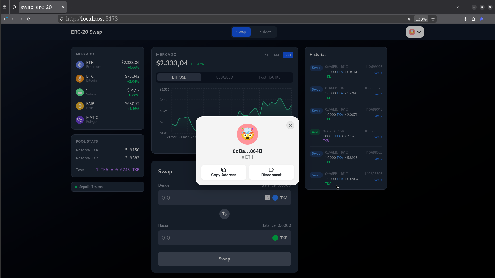
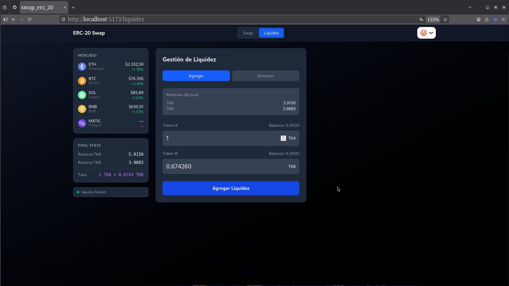
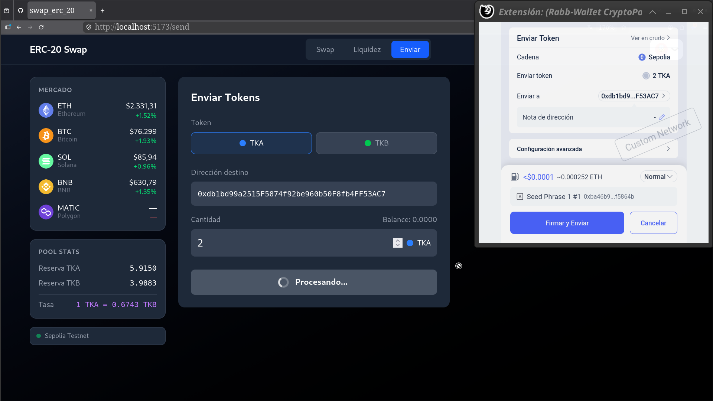
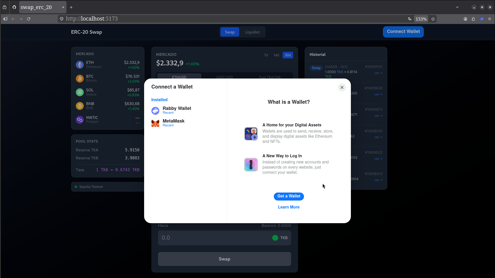

# ERC-20 Swap — Decentralized Exchange on Sepolia

A decentralized exchange (DEX) built with React, Wagmi, and Solidity. Deployed on the Ethereum Sepolia testnet. Supports token swapping, liquidity management, and token transfers — all on-chain, no backend.

## Live Demo

> Deploy link here (Vercel)

**Contracts on Sepolia:**
- SimpleDEX: [`0x3D5B5a5328a0f29375b3cDcBE31B1aB5c2AB906A`](https://sepolia.etherscan.io/address/0x3D5B5a5328a0f29375b3cDcBE31B1aB5c2AB906A)
- Token A (TKA): [`0x039EC09b85F1C317F0831B100eFd5c4e2463f372`](https://sepolia.etherscan.io/address/0x039EC09b85F1C317F0831B100eFd5c4e2463f372)
- Token B (TKB): [`0xBeaC73A7755BeED1337Ca95137EB8b9247f88542`](https://sepolia.etherscan.io/address/0xBeaC73A7755BeED1337Ca95137EB8b9247f88542)

---

## Screenshots

### Swap


### Liquidity Management


### Send Tokens


### Wallet Connection


---

## Features

- **Swap** — Exchange TKA ↔ TKB with automatic approve flow. Detects allowance and requests approval before the swap when needed.
- **Liquidity** — Add or remove liquidity from the pool. Displays live pool reserves and exchange rate.
- **Send** — Transfer TKA or TKB to any wallet address with real-time balance display and address validation.
- **Market Prices** — Live prices for ETH, BTC, SOL, BNB, and MATIC via CoinGecko with 24h change.
- **Price Chart** — Interactive candlestick chart for ETH/USD, USDC/USD, and pool TKA/TKB ratio.
- **Transaction History** — On-chain event log of all swaps and liquidity operations from the DEX contract, with links to Etherscan.
- **Multi-wallet support** — MetaMask, Rabby, WalletConnect via RainbowKit.

---

## Tech Stack

| Layer | Technology |
|---|---|
| Frontend | React 18 + TypeScript + Vite |
| Styling | Tailwind CSS |
| Blockchain | Wagmi v2 + Viem |
| Wallet | RainbowKit |
| Charts | Recharts |
| Market data | CoinGecko API |
| Network | Ethereum Sepolia Testnet |

---

## Architecture

```
src/
├── components/
│   ├── swap/          # SwapCard
│   ├── liquidity/     # LiquidityCard
│   ├── send/          # SendCard
│   ├── history/       # TxHistory
│   ├── charts/        # PriceChart
│   ├── pool/          # PoolInfo
│   ├── sidebar/       # Sidebar (market prices + pool stats)
│   └── Navbar.tsx
├── hooks/
│   ├── useSwap.ts
│   ├── useLiquidity.ts
│   ├── useSend.ts
│   ├── usePoolInfo.ts
│   ├── useTxHistory.ts
│   └── useCoinGecko.ts
├── pages/
│   ├── HomePages.tsx
│   ├── LiquidezPages.tsx
│   └── SendPage.tsx
└── config/
    └── contracts.ts
```

---

## Getting Started

### Prerequisites

- Node.js 18+
- A wallet with Sepolia ETH ([faucet](https://sepoliafaucet.com))

### Installation

```bash
git clone https://github.com/your-username/swap_erc20_react_wagmi.git
cd swap_erc20_react_wagmi/swap_wagmi
npm install
```

### Environment variables

Create a `.env` file in `swap_wagmi/`:

```env
VITE_WC_PROJECT_ID=your_walletconnect_project_id
```

Get a free project ID at [cloud.walletconnect.com](https://cloud.walletconnect.com).

### Run

```bash
npm run dev
```

---

## How it works

### Swap flow
1. User enters amount
2. App checks current allowance on the token contract
3. If allowance is insufficient → triggers `approve()` transaction first
4. Once approved → triggers the swap on the DEX contract

### Liquidity flow
1. User enters Token A amount
2. App calculates the proportional Token B amount based on current pool ratio
3. Triggers `addLiquidity()` or `removeLiquidity()` on the DEX contract

### Transaction history
Reads `Swapped`, `LiquidityAdded`, and `LiquidityRemoved` events directly from the contract using `eth_getLogs` — no indexer or backend required.

---

## License

MIT
